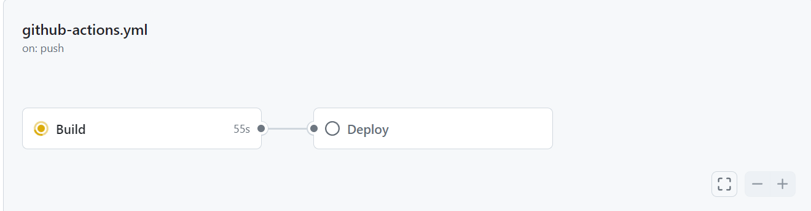

# Github Actions (CI/CD)
Description: Setting up a Continuous Integration / Continuous Deployment pipeline with Github Actions

## Web App 
A property listing site developed with Angular


## Why CI/CD Pipeline?

- **Facilitates Continuous Integration and Deployment**: Streamlines the process of integrating code changes into the main codebase and deploying them to production. 

- **Upholds Code Standards**: Enforces rigorous code standards such as testing, linting, security checks, and vulnerability scanning. This ensures code quality and integrity across the development pipeline compared to local development environments.


## Implementation
- Workflow is triggered on 'push' to any branch. 
- There are 2 jobs: 'Build' and 'Deploy'
- Runs on Ubuntu


### Build
```
- name: Check out repository code
        uses: actions/checkout@v4
```
1) Clones the repository to the runner so that steps in the pipeline can be executed. 

<br/></br>

```
   run: ls ${{ github.workspace }}
      
```
2) List all files in the repository.

<br/></br>

```
    - name: Install Angular CLI and dependencies
      run: |
        npm install -g @angular/cli
        npm install
```
3) - Enables use of Angular's use of 'ng' command in pipeline.
   - Installs dependencies (files) listed in package.json

<br/></br>

```
     - name: Run npm audit
       run: npm audit || true
```
4) - Identify vulnerabilities in the downloaded dependencies

<br/></br>

```
      - name: Lint Angular application
        run: ng lint
```
5) Analyse code for potential errors e.g. code style violations

<br/></br>

```
      - name: Run unit tests
        run: ng test --watch=false || true
```
6) Tests to ensure code work as intended

<br/></br>

```
      - name: Build Angular application
        run: ng build --configuration=production
```
7) Ensures application can be successfully built
<br/></br>



### Deploy


[Site hosted on GCP](https://property-listing-ohf3s6ax5q-as.a.run.app/)


